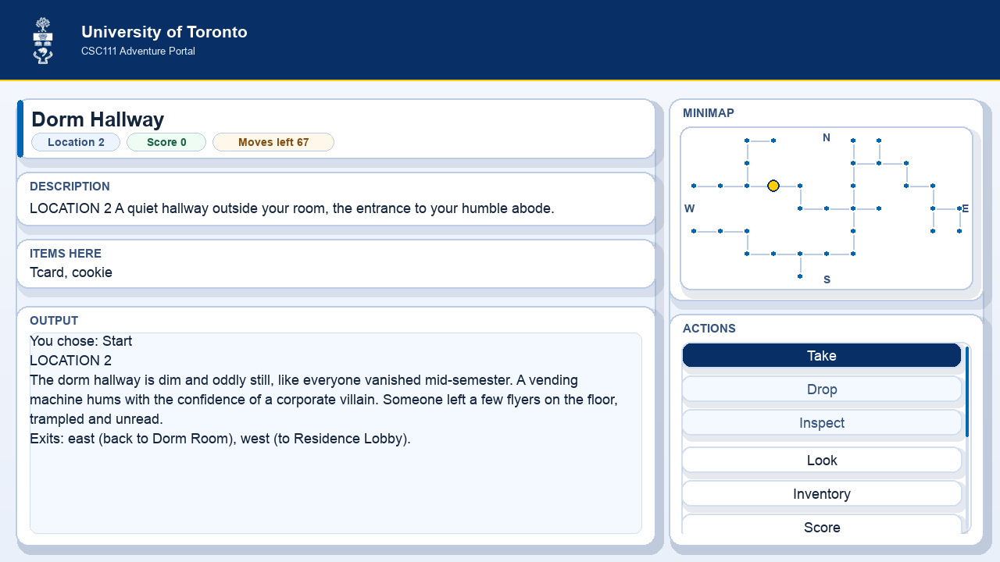
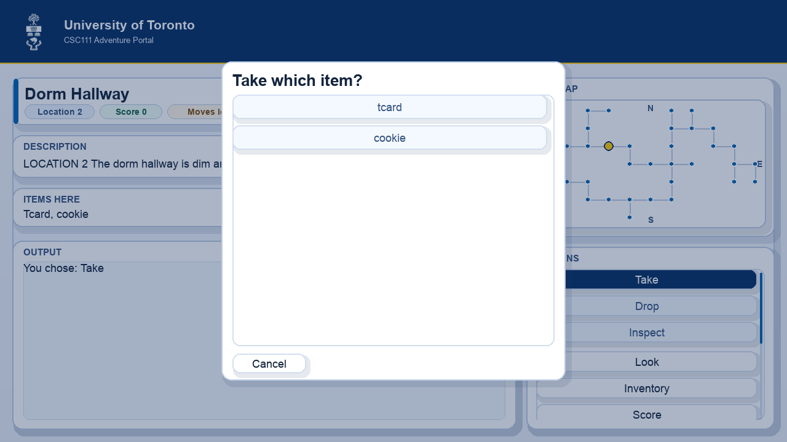
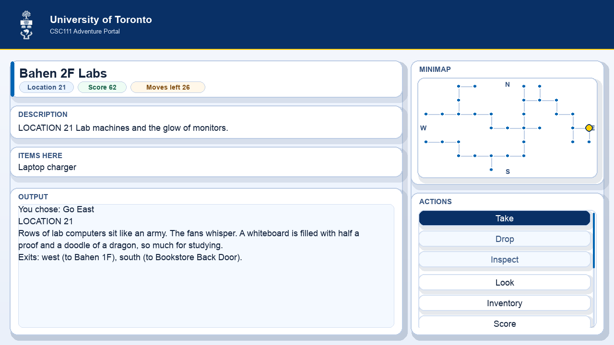

# ACORN Adventure Game

CSC111 Winter 2026 Project 1 by **Nicolas Miranda Cantanhede** and **Cade McNelly**.

A University of Toronto-themed text adventure where you race the deadline, recover your missing project items, and submit before time runs out.

- Terminal gameplay (`adventure.py`)
- ACORN-inspired visual UI (`ui.py`)
- Item-based puzzle progression
- Score-as-grade system (out of 100)

## Visual Preview

| Start Screen | Take Item Modal |
|---|---|
|  |  |

| Lab / Late-Game View |
|---|
|  |

## Core Features

- **Dual interfaces**: full game playable in terminal and Pygame UI
- **Move-limited progression**: default 67 moves (with extension mechanic)
- **Inventory system**: take, drop, inspect, and location-based item targets
- **Event logging**: chronological action history
- **Scoring model**: item returns + side objectives, capped at 100
- **Win/Lose states**:
  - Win by returning required items and meeting score requirement
  - Lose by running out of moves or submitting early without requirements
- **Puzzle chain enhancements**:
  - Dorm access locked by `dorm key`
  - Lab access locked by `lab access form`
  - `toonie -> coffee -> lab access form` progression
  - `signed extension request` grants +30 moves once

## Quick Start

## Requirements

- Python 3.13.x
- `pygame` (for visual UI)

Install pygame if needed:

```bash
python3 -m pip install pygame
```

Run terminal version:

```bash
python3 adventure.py
```

Run visual version:

```bash
python3 ui.py
```

Run simulation demos:

```bash
python3 simulation.py
```

## Commands

### Movement

- `go north`
- `go south`
- `go east`
- `go west`

### Game actions

- `look`
- `inventory`
- `log`
- `score`
- `submit early`
- `quit`

### Item actions

- `take <item>`
- `drop <item>`
- `inspect <item>`

## Win and Lose Conditions

### Win

You win by meeting both:

1. Required returns are completed (`lucky mug`, `laptop charger`, and storage solution via `usb drive` or `spare usb cable`)
2. Score reaches the minimum threshold

Then use `submit early` (or reach the resolved end state in UI flow).

### Lose

You lose if:

1. You run out of moves (default 67, unless extension granted)
2. You submit early before meeting win requirements

## World Map

```text
-1 -1  7  8 -1 -1 32 15 -1 -1 -1
-1 -1  6 -1 -1 -1 14 16 17 -1 -1
 5  4  3  2  1 -1 13 -1 18 19 -1
-1 -1 -1 -1  9 10 11 12 -1 20 21
24 23 22 -1 -1 -1 31 -1 -1 33 25
-1 -1 26 27 28 30 29 -1 -1 -1 -1
-1 -1 -1 -1 34 -1 -1 -1 -1 -1 -1
```

- **Starting location:** `2`

## Optimal Win Walkthrough

```text
["take tcard", "go west", "take signed extension request", "go west", "take dorm key",
"go west", "take lucky mug", "go east", "go east", "go east", "go east", "go south", "go east",
"go east", "go east", "take usb drive", "go west", "go north", "go north", "go east", "go east",
"go south", "go east", "take toonie","go west", "go north", "go west", "go west", "go south",
"go south", "go south", "go south", "go west", "go west", "go west", "drop toonie", "go east",
"go east", "go east", "go north", "go north", "go north", "go north", "go east", "go east",
"go south", "go east", "go south", "go south", "drop coffee", "go north", "go east",
"take laptop charger", "go west", "go north", "go west", "go north", "go west", "go west",
"go south", "go south", "go west", "go west", "go north", "drop lucky mug", "drop usb drive",
"drop laptop charger", "submit early"]
```

## Scoring Notes

- Score is represented as a project-grade style percentage out of 100
- Main objective items are weighted heavily
- Side-objective items provide bonus points
- After win + keep playing mode, score can be locked for exploration

## Project Structure

```text
adventure.py       # terminal command loop + game-state interactions
ui.py              # main Pygame interface loop
ui_primitives.py   # shared UI components (cards, buttons, minimap, scrolling)
ui_endscreen.py    # win/lose end-screen UI
simulation.py      # scripted demos + assertions/doctests
game_entities.py   # Location and Item data classes
event_logger.py    # Event and EventList tracking
game_data.json     # map, items, rewards, restrictions, and narrative data
assets/            # static assets (including UofT crest)
docs/images/       # README screenshots
```

## Development / QA

Doctests:

```bash
python3 -m doctest -v simulation.py
```

Basic compile check:

```bash
python3 -m py_compile adventure.py event_logger.py game_entities.py simulation.py ui.py ui_endscreen.py ui_primitives.py
```

PythonTA (with course-approved config) can be run from each module's main guard or manually.

---

If you’re checking this out for the first time, run the visual version first (`python3 ui.py`) and use the minimap/actions panel to get your bearings quickly.
